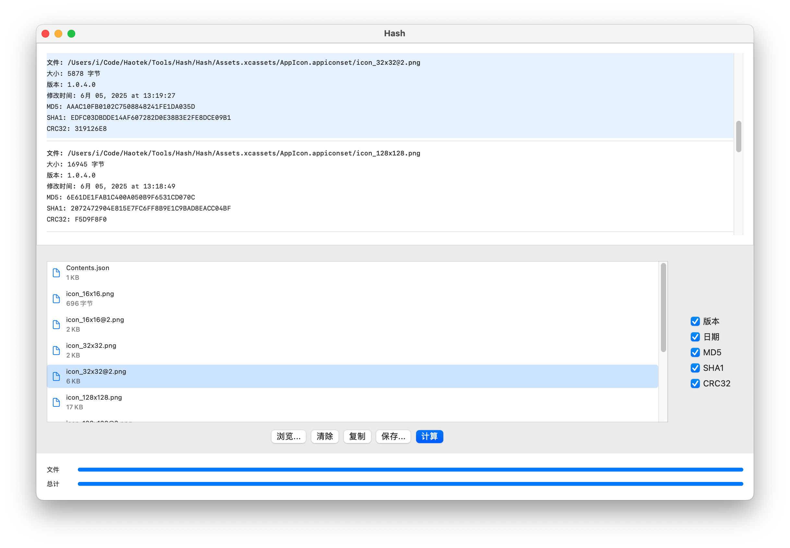

# Hash

一个简洁高效的 macOS 哈希值计算工具，支持多种哈希算法和文件批量处理。

## 功能特性

- 🔐 **多种哈希算法支持**：MD5、SHA-1、CRC32
- 📁 **批量文件处理**：支持同时计算多个文件的哈希值
- 🎯 **拖拽操作**：直接拖拽文件到应用程序窗口即可开始计算
- 📋 **一键复制**：点击即可复制哈希值到剪贴板
- 📊 **文件信息显示**：显示文件大小、版本信息、修改日期等
- 🌍 **多语言支持**：支持 22 种语言，包括中文、英文、日文、韩文、德文、法文、西班牙文、俄文、阿拉伯文等
- 🎨 **现代化界面**：基于 SwiftUI 构建的原生 macOS 应用
- ⚡ **高性能计算**：异步处理，支持大文件计算

## 应用截图



*Hash 应用程序的主界面，展示了文件选择、哈希计算和结果显示功能*

## 系统要求

- macOS 11.0 或更高版本
- Xcode 13.0 或更高版本（开发环境）

## 安装

### 从源码构建

1. 克隆仓库：
```bash
git clone git@github.com:iOSDevLog/Hash.git
cd Hash
```

2. 使用 Xcode 打开项目：
```bash
open Hash.xcodeproj
```

3. 在 Xcode 中构建并运行项目（⌘+R）

## 使用方法

### 基本操作

1. **启动应用程序**：双击应用图标或从 Launchpad 启动

2. **添加文件**：
   - 点击"选择文件"按钮选择文件
   - 或直接将文件拖拽到应用程序窗口

3. **选择哈希算法**：
   - 在右侧面板中勾选需要计算的哈希算法
   - 支持 MD5、SHA-1、CRC32

4. **开始计算**：
   - 点击"开始计算"按钮
   - 或添加文件后自动开始计算

5. **复制结果**：
   - 点击任意哈希值即可复制到剪贴板
   - 支持复制单个哈希值或所有结果

### 高级功能

- **批量处理**：可同时添加多个文件进行批量计算
- **进度显示**：实时显示计算进度
- **文件管理**：支持清除单个文件或清空所有文件
- **结果导出**：可复制所有计算结果

## 技术架构

### 核心技术

- **SwiftUI**：现代化的用户界面框架
- **CryptoKit**：Apple 官方加密框架，用于 SHA-1 计算
- **Foundation**：用于 MD5 和文件操作
- **UniformTypeIdentifiers**：文件类型识别

### 项目结构

```
Hash/
├── Hash/
│   ├── ContentView.swift          # 主界面视图
│   ├── HashApp.swift              # 应用程序入口
│   ├── Assets.xcassets/           # 应用资源
│   │   └── AppIcon.appiconset/    # 应用图标
│   ├── Hash.entitlements          # 应用权限配置
│   └── *.lproj/                   # 多语言本地化文件
├── HashTests/                     # 单元测试
└── HashUITests/                   # UI 测试
```

### 哈希算法实现

- **MD5**：使用 CommonCrypto 框架实现
- **SHA-1**：使用 CryptoKit 框架实现
- **CRC32**：自定义实现，使用标准 CRC32 多项式

## 开发

### 环境配置

1. 安装 Xcode 13.0 或更高版本
2. 确保 macOS 版本为 11.0 或更高
3. 克隆项目并在 Xcode 中打开

### 构建项目

```bash
# 使用 Xcode 命令行工具构建
xcodebuild -project Hash.xcodeproj -scheme Hash -configuration Debug build

# 或在 Xcode 中使用快捷键 ⌘+B
```

### 运行测试

```bash
# 运行单元测试
xcodebuild test -project Hash.xcodeproj -scheme Hash -destination 'platform=macOS'

# 或在 Xcode 中使用快捷键 ⌘+U
```

## 本地化

应用程序支持以下 22 种语言：

### 亚洲语言
- 🇨🇳 中文（简体）
- 🇹🇼 中文（繁体）
- 🇯🇵 日本語
- 🇰🇷 한국어
- 🇹🇭 ไทย (Thai)
- 🇻🇳 Tiếng Việt (Vietnamese)
- 🇮🇳 हिन्दी (Hindi)
- 🇮🇩 Bahasa Indonesia (Indonesian)
- 🇲🇾 Bahasa Melayu (Malay)

### 欧洲语言
- 🇺🇸 English
- 🇩🇪 Deutsch (German)
- 🇫🇷 Français (French)
- 🇪🇸 Español (Spanish)
- 🇮🇹 Italiano (Italian)
- 🇵🇹 Português (Portuguese)
- 🇳🇱 Nederlands (Dutch)
- 🇸🇪 Svenska (Swedish)
- 🇳🇴 Norsk (Norwegian)
- 🇩🇰 Dansk (Danish)
- 🇫🇮 Suomi (Finnish)
- 🇵🇱 Polski (Polish)
- 🇨🇿 Čeština (Czech)
- 🇭🇺 Magyar (Hungarian)
- 🇬🇷 Ελληνικά (Greek)
- 🇹🇷 Türkçe (Turkish)
- 🇺🇦 Українська (Ukrainian)
- 🇷🇴 Română (Romanian)
- 🇧🇬 Български (Bulgarian)
- 🇸🇰 Slovenčina (Slovak)
- 🇸🇮 Slovenščina (Slovenian)
- 🇭🇷 Hrvatski (Croatian)
- 🇷🇸 Српски (Serbian)
- 🇷🇺 Русский (Russian)

### 中东语言
- 🇸🇦 العربية (Arabic)
- 🇮🇱 עברית (Hebrew)

### 添加新语言

1. 在 Xcode 中选择项目
2. 在 "Localizations" 部分添加新语言
3. 翻译 `Localizable.strings` 文件中的字符串

## 贡献

欢迎提交 Issue 和 Pull Request！

### 贡献指南

1. Fork 项目
2. 创建功能分支 (`git checkout -b feature/AmazingFeature`)
3. 提交更改 (`git commit -m 'Add some AmazingFeature'`)
4. 推送到分支 (`git push origin feature/AmazingFeature`)
5. 创建 Pull Request

## 许可证

本项目采用 MIT 许可证 - 查看 [LICENSE](LICENSE) 文件了解详情。

## 更新日志

### v1.0.0
- ✨ 初始版本发布
- 🔐 支持 MD5、SHA-1、CRC32 哈希算法
- 📁 支持批量文件处理
- 🎯 支持拖拽操作
- 🌍 支持多语言界面
- 🎨 现代化 SwiftUI 界面

## 联系方式

如有问题或建议，请通过以下方式联系：

- 提交 Issue：[GitHub Issues](https://github.com/iOSDevLog/Hash/issues)
- 项目主页：[GitHub Repository](https://github.com/iOSDevLog/Hash)

---

**Hash** - 让文件哈希计算变得简单高效 🚀